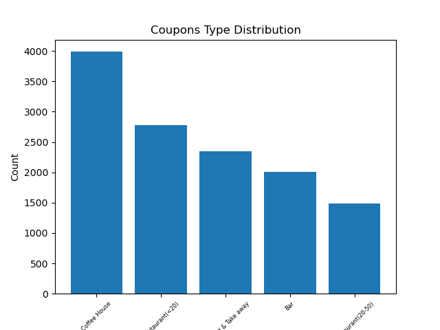
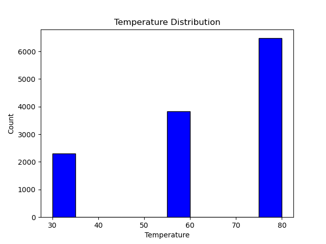
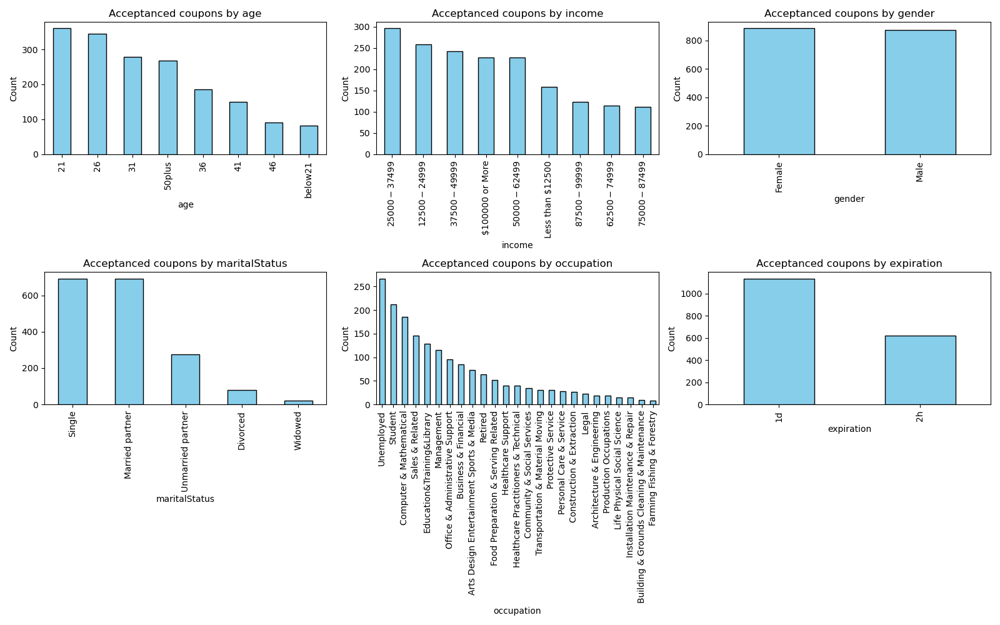

# Coupon Acceptance Analysis
This project explores factors that influence whether drivers accept or reject driving coupons. Using a dataset from the UCI Machine Learning Repository, we analyze user demographics, driving context, and coupon characteristics to uncover behavioral trends and patterns in coupon redemption.
To identify and visualize the key differences between individuals who accept a driving coupon versus those who do not, using statistical analysis and Python-based data visualization.

## Exploratory Data Analysis
### Understand the Data and Data Collection
This data comes to us from the UCI Machine Learning repository and was collected via a survey on Amazon Mechanical Turk.

- **Size:** 12,684 observations with 26 features

- **Label:**
  - Y = 1: Accepted the coupon (immediately or before expiration)
  - Y = 0: Rejected the coupon

- **Features:**
  - User attributes: Gender, age group, marital status, occupation, income, education, number of children, and behavior (e.g., frequency of visiting bars, restaurants, etc.)

  - Contextual attributes: Destination, passenger, weather, temperature, and time of day

  - Coupon attributes: Type of venue and time before expiration

### Data Cleaning
The dataset was examined for missing or problematic values, and the following potential data quality issues were identified.
- **Missing Data:**
The Car column contains 12,576 missing values out of 12,684 total rows—approximately 99.1% missing. This means only 108 rows have valid entries, making the column extremely sparse. Such limited information is unlikely to add value to the analysis and may introduce noise. Therefore, this column can be safely dropped.

Other columns with missing values include:

  - Bar: 107 missing

  - CoffeeHouse: 217 missing

   - CarryAway: 151 missing

   - RestaurantLessThan20: 130 missing

   - Restaurant20To50: 189 missing

Each of these represents less than 2% missing data, which is typically acceptable. In cases where missing values cannot be reliably imputed and account for less than 5% of the data, it is generally safe to ignore them in the analysis.

- **Duplicate Data:**
  There are 74 duplicate rows in the dataset, which have been removed.
### Data Visualization
A bar plot is used to visualize the distribution of the coupon column, while a histogram illustrates the distribution of the temperature column.

### Data Summarization
- 57% of total observations indicate that the coupon was accepted.
- Investigating the Bar Coupons:
  - 41% of bar coupons were accepted.
  - Drivers who go to a bar 3 or fewer times per month had a 37% acceptance rate.
  - Drivers who go to a bar more than 3 times per month had a significantly higher acceptance rate of 76%.
  - Among drivers who go to bars more than once a month and are over the age of 25, the acceptance rate is 70%.
  - Drivers who go to bars more than once a month, had passengers other than kids, and work in occupations outside of farming, fishing, or forestry, showed an acceptance rate of 71%.
  - Drivers who go to bars more than once a month, had passengers who were not kids, and were not widowed, also showed a 71% acceptance rate.
  -  For those who go to bars more than once a month and are under the age of 30, the rate increases to 73% 
  -  Drivers who go to cheap restaurants more than 4 times per month and have an income below $50K had a 60% acceptance rate for coupons.

    ### Hypothesis Testing
- **Hypothesis Statement:**
Drivers who frequently visit bars and meet specific demographic or situational criteria are significantly more likely to accept bar coupons than those who do not.
- **Supporting Observations for the Hypothesis:**
Drivers who go to bars more than 3 times per month have a 76% acceptance rate, compared to 37% for those who go less frequently. Acceptance rates remain above 70% for frequent bar-goers who are:

  - Over age 25

  - Under age 30

  - Accompanied by passengers (excluding kids)

  - Not widowed

  - Working outside of farming, fishing, or forestry

These factors suggest that bar coupon acceptance is driven by lifestyle patterns and social context, such as age, companion type, and occupation.

### Independent Investigation
We examine the Carry out & Take away coupon group to identify the characteristics of passengers who are more likely to accept these coupons. 
- Investigating the Carry out & Take away Coupons:
  - 74% of Carry out & Take away coupons were accepted.

